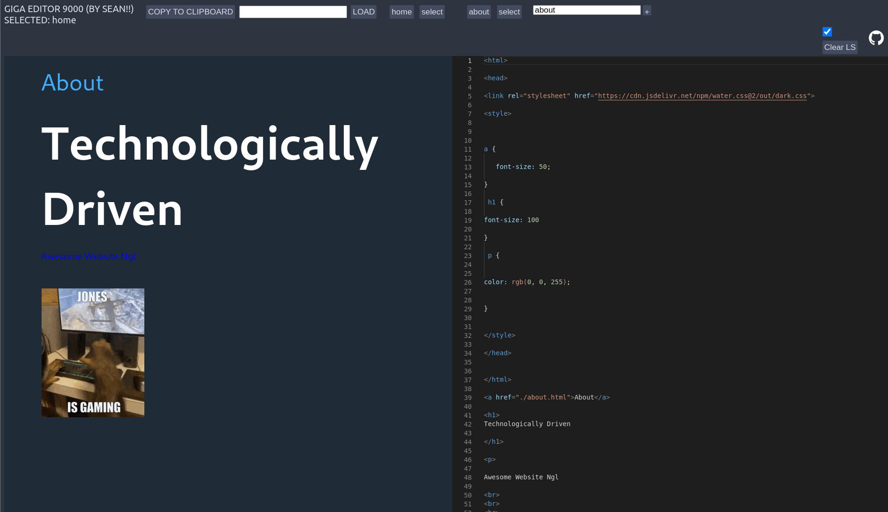

#### liveview

Live html editor in browser using iframe/embed tags, to be used for messing with html on school computers.

Very janky, since links cannot be followed in sandboxed iframe elements so I've implemented a tab system so you can have multiple tabs of data.

This is not meant to be used for anything serious, just to help teach some people HTML and CSS basics at school without access to an IDE.

##### example

##### features:

* live edit html on right, output on the left
* instant feedback
* tab system saves on reloads using browser localStorage
* export tab session to clipboard, import with pasting
* unlimited named tabs
* correctly handle tab character inside textarea element
* really cool i swear
